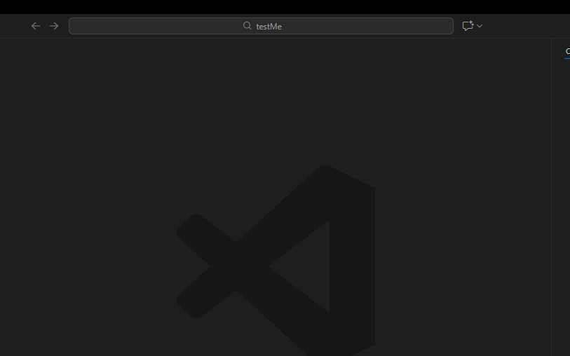

<div dir="rtl">
<table dir="rtl" align="right">
<tr><td>

# Docs-as-System VS Code Extension

הרחבה שמייצרת עבורך פרויקט Docs-as-System מלא – כולל תבניות, תצורה וסקריפטי Git – ישירות מתוך VS Code.



## מה זה עושה?

ההרחבה יוצרת עבורך פרויקט מלא ומאורגן הכולל:

• **תיקיית `docs/`** עם תבניות מסמכים מוכנות (תכנון, ארכיטקטורה, אוטומציה, לוגים)  
• **תיקיית `src/`** לקוד המקור  
• **סקריפטי Git** לניהול ענפים, commits ו-pull requests  
• **קבצי תצורה** (.gitignore, .editorconfig, .gitattributes)  
• **CHANGELOG.md** לתיעוד שינויים

**מיועד במיוחד לעבודה עם AI Agents – וכל התבניות, המדיניות והמסמכים נוצרים בעברית מלאה.**

---

## איך משתמשים?

### שלב 1: התקנה
התקן את ההרחבה מ-VS Code Marketplace (החיפוש הוביל אותך לכאן!)

### שלב 2: יצירת פרויקט חדש

1. פתח את VS Code בתיקייה שבה תרצה ליצור את הפרויקט (או תיקייה ריקה)

2. **לחץ על `Ctrl+Shift+P`** (או `Cmd+Shift+P` ב-macOS) לפתיחת Command Palette

3. **רשום:** `Docs-as-System: Create New Docs-as-System Project`

4. **הזן שם** לפרויקט החדש

5. **זהו!** הפרויקט נוצר עם כל המבנה והתבניות

---

## מה מקבלים?

הפרויקט שנוצר כולל:

• מבנה תיקיות מלא וסטנדרטי  
• תבניות מסמכים לפי השיטה  
• סקריפטי Git מוכנים לשימוש  
• קבצי תצורה בסיסיים  
• CHANGELOG ו-Implementation Guide  
• תמיכה מלאה בעברית

מבנה הפרויקט:

</div>
<div dir="ltr" style="text-align: left;">

```
my-project/
├── 📁 docs/
│   ├── 📁 agent/          # הגדרות סוכן AI ומדיניות תפעול
│   ├── 📁 architecture/   # תכנון ארכיטקטורה והחלטות עיצוב
│   ├── 📁 automation/     # Workflows, Guardrails, Prompts
│   ├── 📁 logs/           # יומני ביצוע ותיעוד
│   ├── 📁 planning/       # דרישות עסקיות, מפרט ותוכנית עבודה
│   └── 📁 project/        # סקירת פרויקט ותיעוד כללי
├── 📁 src/                # קוד המקור שלך
├── 📁 automation/git/     # סקריפטים לניהול Git
├── 📄 CHANGELOG.md
├── 📄 PROJECT_IMPLEMENTATION_GUIDE.md
└── קבצי תצורה (.gitignore, .editorconfig, וכו')
```

</div>
<div dir="rtl" style="text-align: right;">

---

## מתאים במיוחד אם אתה:

• **מפתח שעובד עם AI Agents** (GitHub Copilot, ChatGPT, Claude וכו'׳)  
• **חלק מצוות שרוצה תיעוד מובנה** מההתחלה  
• **מנהל פרויקט שצריך מתודולוגיה עקבית** בין תכנון לביצוע  
• **מי שרוצה לנהל פרויקט בצורה מסודרת ושקופה**

---

## קישורים שימושיים

- **אתר המתודולוגיה:** [https://tomkedem.github.io/Docs-as-System/](https://tomkedem.github.io/Docs-as-System/)
- **GitHub Repository:** [https://github.com/tomkedem/Docs-as-System-VSCode-Extension](https://github.com/tomkedem/Docs-as-System-VSCode-Extension)
- **דיווח על בעיות:** [GitHub Issues](https://github.com/tomkedem/Docs-as-System-VSCode-Extension/issues)

---

## רישיון

MIT License - חופשי לשימוש, שינוי והפצה

---

**פותח על ידי תומר קדם**

</td></tr>
</table>
</div>